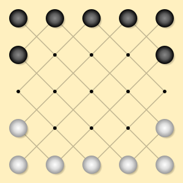

 

# Five-Field Kono

Five-Field Kono is a C++ app that uses retrograde analysis to strongly solve the game of [Five-Field Kono](https://en.wikipedia.org/wiki/Five-field_kono). Unfortunately, the solution is boring (either player can easily force a draw through an endless repetition of moves), so I never did anything with the solution.

### License

The source code for this app has been released under the [MIT License](LICENSE).

### Copyright

© 2023 Stephen E. Bensley

## Building from Source

The app was developed with [Xcode](https://developer.apple.com/xcode/), which is freely available from Apple. After installing Xcode and cloning the repo, open the Xcode [project](FiveFieldKono.xcodeproj) at the root of the repo. Check out the most recent tag to ensure a stable build.

The code is entirely standards-compliant C++17, so it should be easy to compile on other platforms.

### Dependencies

None.

### Targets

The Xcode project has the following targets:

- Engine: Static library consumed by the other targets
- run_tests: Unit tests implemented using [Catch2](https://github.com/catchorg/Catch2)
- play: Plays both sides of a game of Five-Field Kono using the optimal strategy
- analyze: Solves the game of Five-Field Kono
